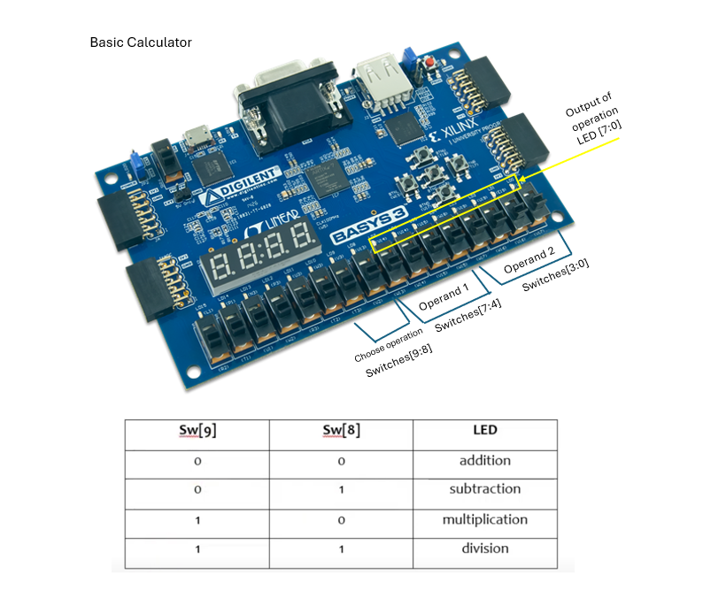

# Calculator-implementation-on-Basys-3
This repository contains the implementation of a basic calculator using Verilog on the Basys 3 FPGA development board. The calculator performs arithmetic operations like addition, subtraction, multiplication, and division based on user input from the board's switches. The result is displayed on the LEDs.

# Features

Two 4-bit operands: Represented by the first 8 switches (SW0-SW7).

Operation selection: Controlled by two switches (SW8 and SW9).

SW8 = 0, SW9 = 0: Addition

SW8 = 0, SW9 = 1: Subtraction

SW8 = 1, SW9 = 0: Multiplication

SW8 = 1, SW9 = 1: Division

Output display: First 8 LEDs (LED0-LED7) show the result of the operation

